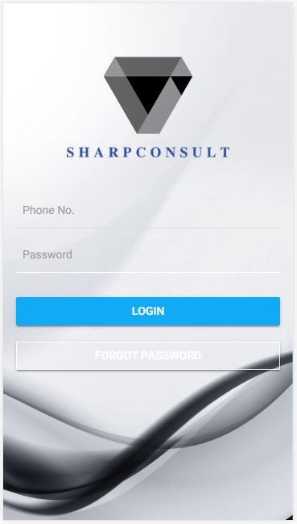
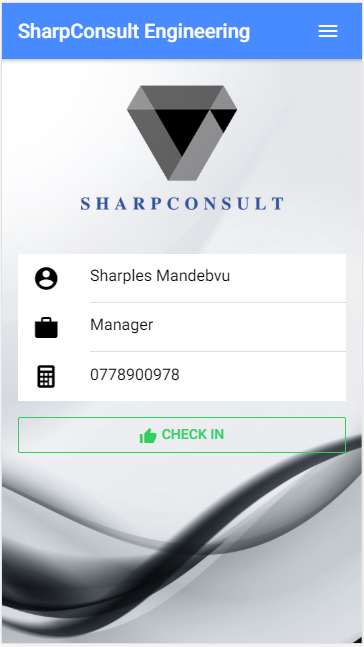
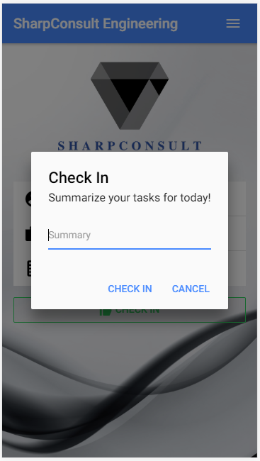
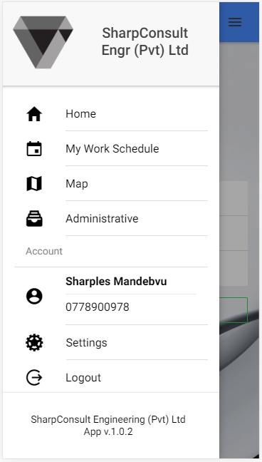
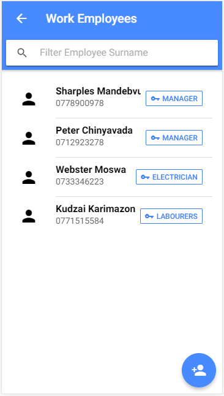
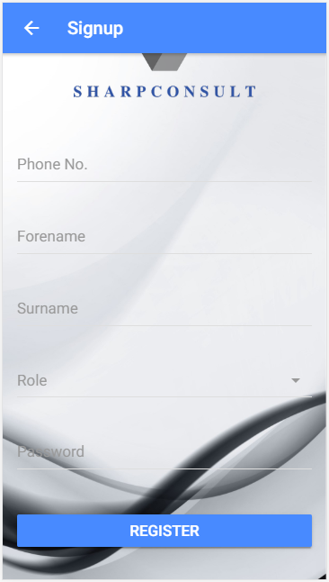
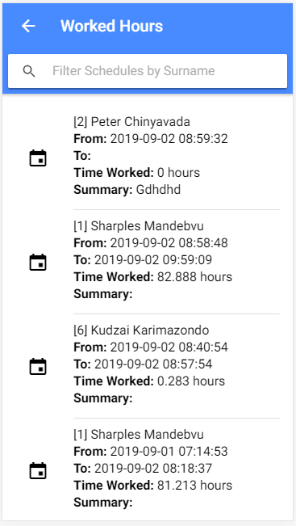

# ParlyConnect
ParlyConnect is a civic technology that promotes Government to Citizen Interaction to increase accountability and transparency. The app allows citizens and members of parliament to communicate and share opinions. Citizens can view and vote in support or against Bills. Citizens can also petition the government through digital signatures. MPs can view how their constituents feel about a certain topic through votes and chats.

##Objectives
1. to track geographical locations of each employee on duty
2. to calculate hours put in by each employee for calculation of wages

## Screenshots

## Installations
### Prerequisites
1. PHP Server 7+
2. MySQL database server
3. NodeJS
4. Android SDKs

### Stages
1. npm i -g ionic
2. npm i -g cordova
3. Open project folder via console and run
npm i
4. extract the server_side_api.zip and add to web root
5. create database named hackathorn and import sharpconsult.sql
6. in project path run
ionic serve
7. when the login screen appears, slide from left to right and configure server ip e.g http://localhost/sharpconsult/
